# Profiles

## 简介

vscode 有上百个设置，上千个扩展，以及无数调整 UI 布局的方法来定制编辑器。通过 vscode 配置文件（profile）可以创建自定义集合，并支持在它们之间快速切换和共享。

## 创建 Profile

vscode 的当前配置为默认 profile。所有自定义设置、安装插件以及对 UI 的修改都保存在默认 profile 中。

创建 Profiles 有三种操作方式：

1. 通过菜单 **File** > **Preferences** > **Profile** > **NewProfile**；
2. 通过  **Manage** > **Profile** > **NewProfile**；
3. 通过 Ctrl+Shift+P 命令。

三种操作方式的效果是相同的。

以菜单方式为例： **File** > **Preferences** > **Profile** > **NewProfile**

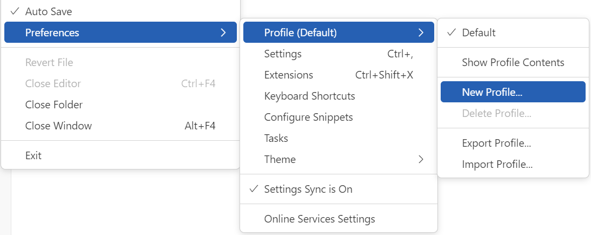

可以在当前 profile 的基础上创建新的 profile (**Copy from**)，或者创建一个空的 Profile。空 profile 不包含任何自定义内容（设置、扩展、snippets 等）。

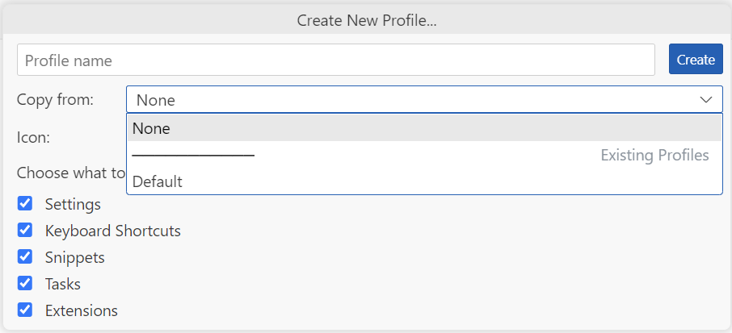

### Profile 子集

可以只自定义一部分配置，从上图可以看出，vscode 配置分为 5 部分：

1. Settings
2. Keyboard Shortcuts
3. Snippets
4. Tasks
5. Extensions

只勾选一部分，表示只对勾选的部分自定义，余下采用默认配置。

例如，快捷键采用 vscode 的默认值，自定义余下部分：

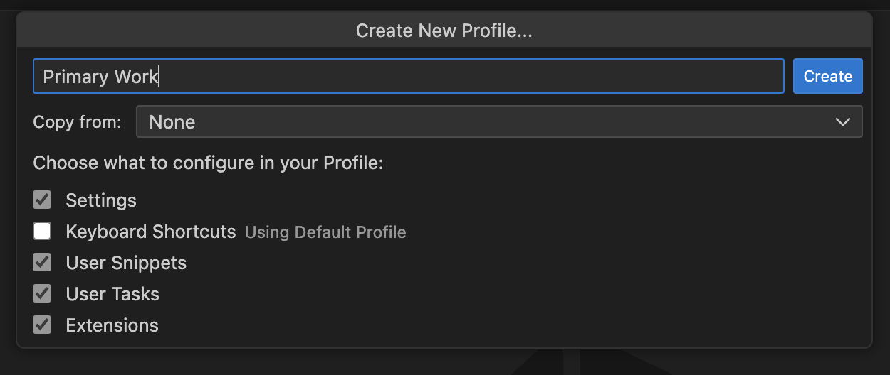

### 创建 Profile 时无法勾选设置

如果创建 Profile 时碰到如法勾选的问题，如下所示：

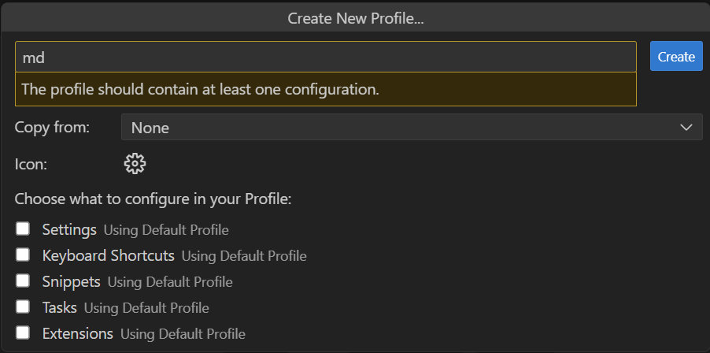

可以启用新的 profile UI：

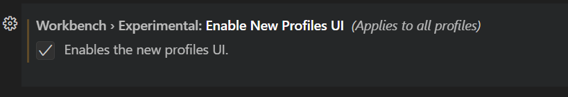

此时创建 profile 的 UI 如下：

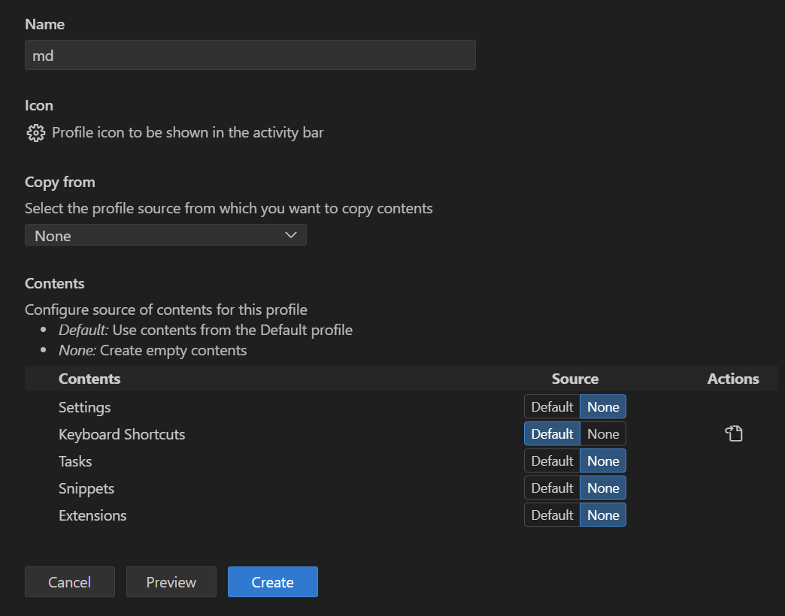

参考：https://github.com/microsoft/vscode/issues/224788

### 当前 profile

当前 profile 的名称在 vscode UI 的多个地方有显示，除了创建 Profiles 菜单栏，最易查看的是左下角的齿轮上会显示当前 profile 的前两个字母：

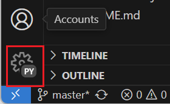

这里 "PY" 是名为 python profile 的前两个字母。

### 设置 profile

选择 profile 后，对 vscode 的任何设置，插件的安装和卸载，界面调整等都会自动保存到当前 profile。

### 关联 Workspace

创建并选择的 profile 会自动与当前 workspace 关联，下次打开这个目录，会自动激活之前选择的 profile。

打开另一个目录，profiles 也会自动切换到这个目录之前关联的 profile。

## 管理 Profile

### 切换 profile

切换方法：

1. 使用命令面板：`Profiles: Switch Profile`
2. 使用菜单：和创建 profile 一个地方，点击对应的 profile 名称即完成切换

### 删除 profile

删除方法：

1. 使用命令面板：`Profiles: Delete Profile...`
2. 在 profiles 窗口

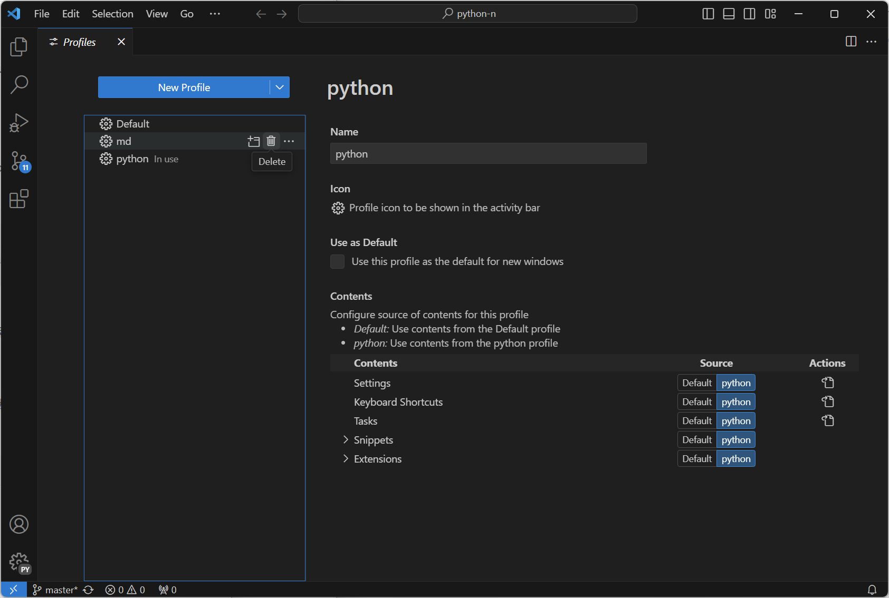

### 以指定 profile 打开新的窗口

菜单栏，File > New Window with Profile:

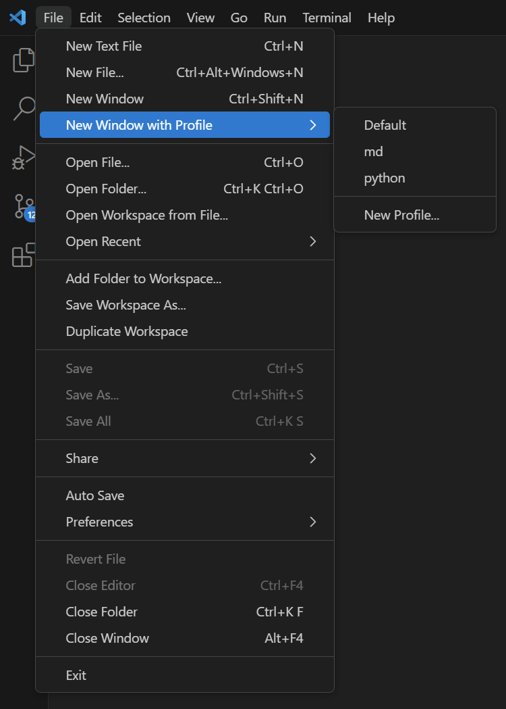

## Profile 内容

在新的 profile UI 中可以看到，profile 内容分为 5 个部分：

1. Settings, 保存在 profile 的 settings.json 文件中；
2. Extensions, profile 包含的插件列表；
3. Keyboard Shortcuts, 快捷键，保存在 profile 的keybindings.json 中；
4. Snippets，保存在 profile 的 `{language}.json` 文件中；
5. Tasks，保存在 profile 的 `tasks.json` 文件中。

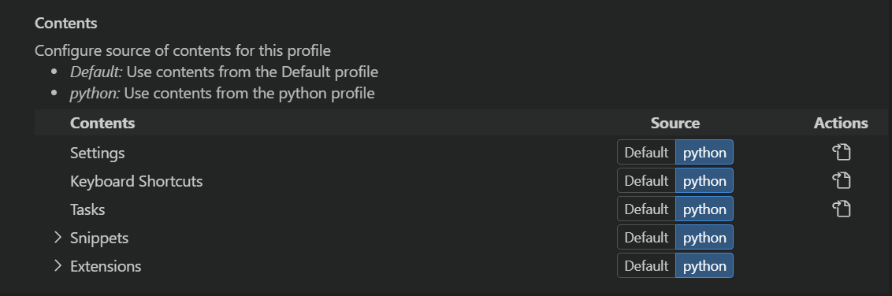

> [!NOTE]
>
> 在 profile 中禁用某个插件，并不会将该插件从该 profile 移除，但是如果导出该 profile，导出的 profile 不包含该插件。

### 设置应用于所有 profiles

将设置应用于所有 profiles 方式如下：

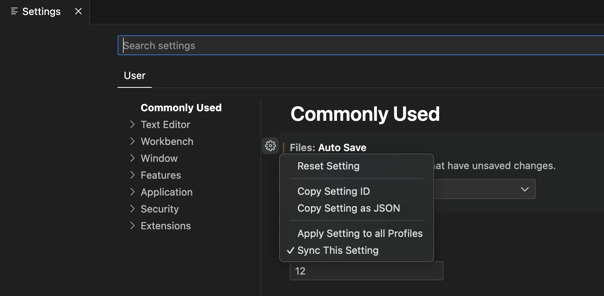

勾选 "Apply Setting to all Profiles" 后，在任何 profile 修改的设置都会应用于所有 profile 文件。

### 插件应用于所有 profiles

点击 Apply Extension to all Profiles 可以将插件应用于所有 profiles：

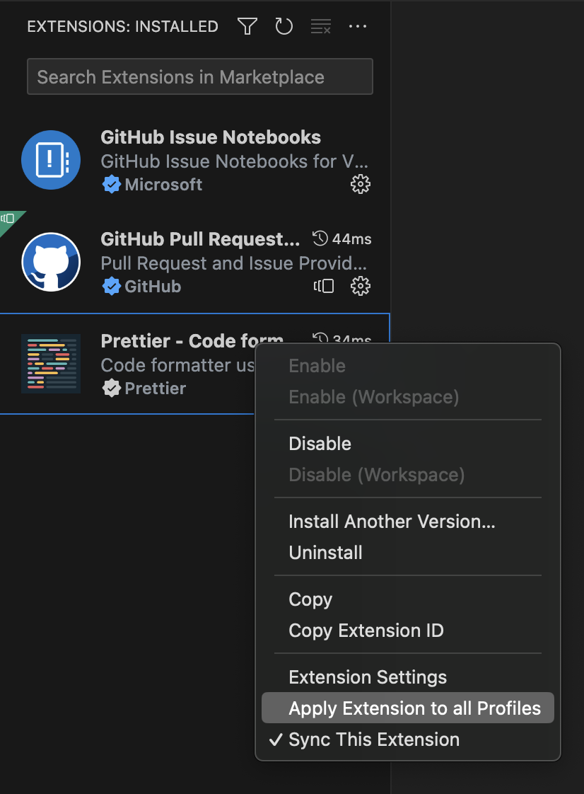

勾选后，该插件在所有 profiles 都可用。

## Profiles 同步

在命令面板，打开 **Settings Sync: Configure**

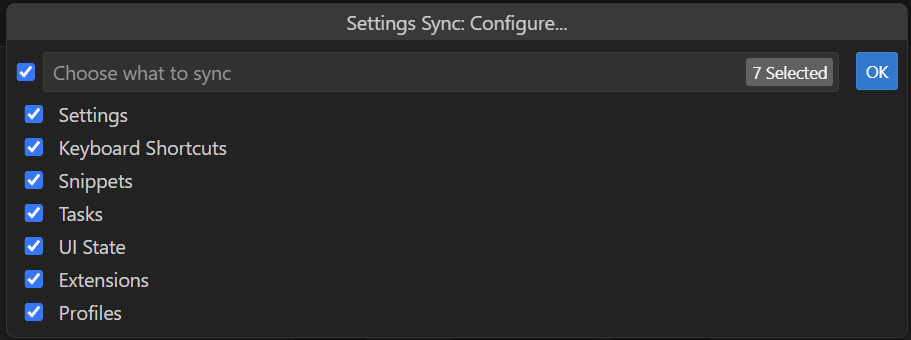

勾选 Profiles，即可完成 Profiles 同步。

## 共享 Profiles

### 导出

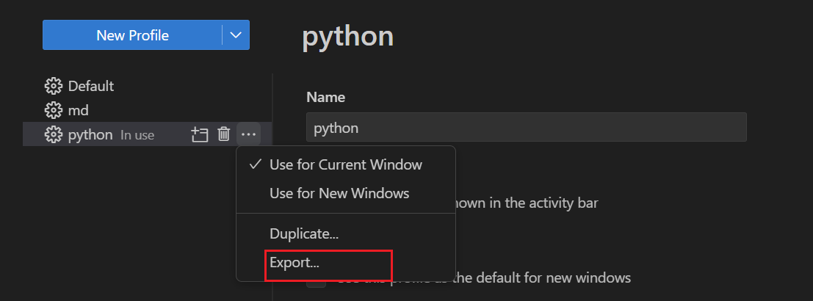

### 导入

## Profile 模板

